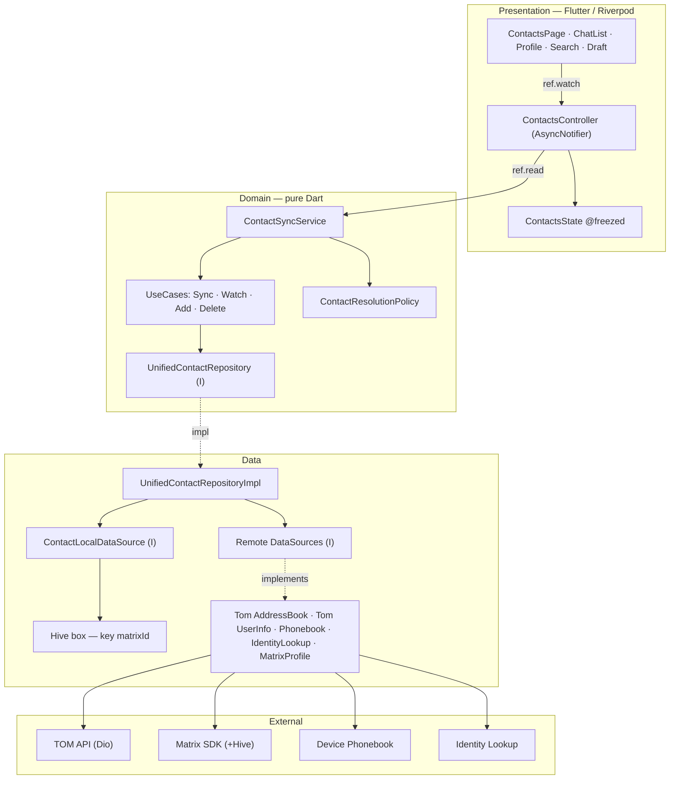

# Migration example: Contacts module (Unified Contact Store)

> **Author**: Clement
> **Last updated**: 2026-09-12
> **Status**: Draft — pending product decision on the display-name resolution policy (§7)
> **Reference documents**: [00_why_riverpod.md](./00_why_riverpod.md), [01_migration_plan.md](./01_migration_plan.md), [02_example_invitation_module.md](./02_example_invitation_module.md), [ADR 0029](../adr/0029-update-fetching-contacs-flow.md)

---

## 1. Why this module

Contacts is the perfect **entry point** for the Riverpod migration, and not only because
the migration plan already lists it in Wave 2:

- It is the **root cause of a visible user-facing bug**: the same person appears with
  different names depending on the screen (list of conversations, chat title, member list,
  profile page, contacts tab…).
- It is a **read-only-heavy domain**: the app reads identity data on almost every screen,
  but writes very little. A single read model fixes most of the problem.
- It has **5 distinct data sources** and no merge layer, which forces every screen to
  re-implement its own resolution logic.
- It is **weakly coupled to the Matrix timeline**: no need to touch the event sync loop.
- It has enough moving parts to validate the full stack of the target architecture
  (DataSource → Repository → UseCase → Service → Controller) without being the 20-interactor
  Room module.

This document is the Contacts counterpart of `02_example_invitation_module.md`.

---

## 2. Current data sources

| Source | What it provides | Storage |
|---|---|---|
| **Matrix SDK** | Profiles (`displayName`, `avatarUrl`), room members | Hive local + SDK memory |
| **TOM AddressBook API** | Organisational contacts (`GET /_twake/addressbook`) | Memory only (`_contactsNotifier`) — not persisted |
| **TOM UserInfo API** | User profile (LDAP/directory name) | Memory only — not persisted |
| **HTTP in-memory cache** | Dio cache interceptor | Memory |
| **Phonebook (device)** | Device contacts via `flutter_contacts` | Hive local (`thirdPartyContactsBox`) |
| **Federation Identity Lookup** | Resolves phone/email → Matrix ID | Stored in Hive + uploaded to TOM server |

### 2.1 Current orchestration (code)

- `lib/domain/contact_manager/contacts_manager.dart` — a 487-line **god object**: holds five
  get_it interactors, four `StreamSubscription`s, four `ValueNotifier`s, the
  post-address-book logic and the cross-device sync. Registered in get_it.
- `lib/presentation/mixins/contacts_view_controller_mixin.dart` — a 776-line mixin:
  debounce, `Either<Failure, Success>` to `PresentationContact` mapping, and the **only
  merge rule in the app** (`_combineTomContacts`, `_flatMatrixIdsFromPhonebookContacts`).
- `lib/pages/contacts_tab/widgets/add_contact/add_contact_dialog.dart` — calls
  `getIt.get<PostAddressBookInteractor>()` and `Matrix.of(context)` directly.
- `lib/presentation/extensions/contact/presentation_contact_extension.dart` —
  `combineDuplicateContact`, a **third** implementation of the dedup rule.
- `lib/pages/search/search_mixin.dart` — `combineDuplicateContactAndChat`, a **fourth**
  merge implementation for the search screen.

### 2.2 There is no merge

`ContactsManager` keeps **two independent notifiers**:

- `_contactsNotifier` → TOM contacts
- `_phonebookContactsNotifier` → device contacts

The "merge" happens **in the presentation layer only**, in
`ContactsViewControllerMixin._combineTomContacts()`
(`lib/presentation/mixins/contacts_view_controller_mixin.dart:707-751`): if a TOM contact
shares a `matrixId` with a phonebook contact, the **TOM contact is removed** and the
phonebook name is kept (ADR 0029).

Consequence: the merge is a UI concern, untestable in isolation, duplicated for search, and
invisible to every screen that is not the Contacts tab.

---

## 3. The bug: one user, up to 4 names

| Screen | `displayName` source | Avatar source |
|---|---|---|
| Conversation list (`chat_list_item.dart:91`) | Matrix SDK `room.getLocalizedDisplayname()` | `room.avatar` (Matrix) |
| Chat title bar (`chat_app_bar_title.dart:53-85`) | TOM contacts > Matrix SDK (DM only) | Matrix SDK |
| Chat detail — member list (`participant_list_item.dart:115`) | Matrix SDK `User.calcDisplayname()` | Matrix SDK |
| User profile page (`profile_info_header.dart:60`) | TOM UserInfo API > Matrix SDK | TOM UserInfo > Matrix SDK |
| Chat profile panel (`chat_profile_info_app_bar.dart:185`) | Matrix Profile API > TOM contact > Matrix SDK | Matrix Profile API |
| Draft chat (`draft_chat_view.dart:365`) | Matrix Profile API > PresentationContact > `receiverId` | Matrix Profile API |
| Contacts tab (TOM) | `AddressBook.displayName` (TOM server) | Matrix `getProfileFromUserId()` (network) |
| Contacts tab (Phonebook) | Device contact name | Matrix `getProfileFromUserId()` (network) |
| Search | `PresentationContact.displayName` (TOM or phonebook) | Matrix `getProfile()` (network) |

**Concrete scenario** — "Jean Dupont" in the directory vs "Jean Travail" in the phone:

1. The user saves "Jean Travail" with `jean@company.com`.
2. Identity lookup resolves `jean@company.com` → `@jean:matrix.company.com`.
3. The contact is uploaded to TOM with `displayName: "Jean Travail"`.
4. On the next TOM sync the server returns "Jean Travail".

Visible result:

- Contacts tab: **"Jean Travail"** (phonebook name, persisted server-side)
- Conversation list: **"Jean Dupont"** (Matrix profile)
- Profile page: **"Jean Dupont"** (TOM UserInfo, LDAP/directory)
- Messages in the chat: **"Jean Dupont"** (Matrix `User.calcDisplayname()`)

No reconciliation mechanism exists.

### 3.1 Storage reality

- TOM contacts are **not** persisted locally → re-fetched at every app start, no offline mode.
- Phonebook contacts **are** persisted locally.
- Matrix user profiles are **not** persisted locally (only room members are).
- TOM UserInfo is **not** persisted locally.
- Avatars are **never** stored locally — there is no local model for avatar persistence.

---

## 4. Root cause

There is **no single read model** for identity. Every screen resolves identity from whichever
source is closest to hand, and the three sources disagree by design (directory vs Matrix
profile vs local alias). The `ContactsManager` + `ContactsViewControllerMixin` pair only
reconciles two of the five sources, only for one screen, and only in the view layer.

The fix is not "add a merge function" — it is to introduce a **unified contact read model**
that every screen consumes, fed by a background sync service that owns the resolution policy.

---

## 5. Target architecture

### Figure 1 — Layered view (Clean Architecture)

Dependencies always point inward. `package:matrix` appears only in
`MatrixProfileDataSourceImpl`.

```
┌──────────────────────────────────────────────────────────────────────────────┐
│ PRESENTATION (Flutter + Riverpod)                                             │
│                                                                                │
│   ContactsPage      ChatList     ProfilePage     Search       DraftChat        │
│   (ConsumerWidget)   item…        …              …            …                │
│         │                                                                      │
│         │  ref.watch(contactsControllerProvider)   ── display only            │
│         ▼                                                                      │
│   ContactsController (AsyncNotifier)  ──→  ContactsState (@freezed)           │
│         │  ref.read(...).sync() / addContact() / deleteContact()  ── actions  │
└─────────┼──────────────────────────────────────────────────────────────────────┘
          ▼
┌──────────────────────────────────────────────────────────────────────────────┐
│ DOMAIN  (pure Dart — NO Flutter / Riverpod / SDK / Dio)                       │
│                                                                                │
│   ContactSyncService            ← orchestration + background sync             │
│        ├─ SyncContactsUseCase                                                     │
│        ├─ WatchUnifiedContactsUseCase                                             │
│        ├─ AddContactUseCase                                                       │
│        └─ DeleteContactUseCase                                                    │
│                                                                                │
│   ContactResolutionPolicy       ← priority + merge (replaces _combineTomContacts,│
│                                    combineDuplicateContact, search_mixin)      │
│                                                                                │
│   UnifiedContactRepository (I)          ContactMutationRepository (I)          │
│   entities : UnifiedContact (key=matrixId), ContactSourceValue,                │
│              ContactSourceKind, ContactException (sealed)                      │
└─────────┼──────────────────────────────────────────────────────────────────────┘
          ▼  (implemented by)
┌──────────────────────────────────────────────────────────────────────────────┐
│ DATA                                                                           │
│                                                                                │
│   UnifiedContactRepositoryImpl   ← maps DTO/SDK types → domain entity         │
│        │                                                                       │
│        ├─ ContactLocalDataSource (I) → Impl → ┌──────────────────────┐        │
│        │                                        │ Hive box (key matrixId)│       │
│        │                                        └──────────────────────┘        │
│        │                                                                       │
│        └─ Remote DataSources (I) → Impl                                        │
│             ├─ TomContactRemoteDataSource        → Dio (/_twake/addressbook)   │
│             ├─ TomUserInfoRemoteDataSource       → Dio (/_twake/v1/user_info)  │
│             ├─ PhonebookRemoteDataSource         → flutter_contacts            │
│             ├─ IdentityLookupRemoteDataSource    → federation / twake lookup   │
│             └─ MatrixProfileDataSource           → package:matrix (ONLY import)│
└─────────┼──────────────────────────────────────────────────────────────────────┘
          ▼
┌──────────────────────────────────────────────────────────────────────────────┐
│ EXTERNAL :  TOM API (Dio) │ Matrix SDK (+Hive) │ Device Phonebook │ Identity  │
└──────────────────────────────────────────────────────────────────────────────┘
```

### Figure 2 — Read path (every screen)

```
Screens ──watch──▶ ContactsController ──watch──▶ UnifiedContactRepository
                                                        │
                                                        ▼
                                            UnifiedContactStore (Hive, local)
                                            = 1 entry per matrixId
```

No direct network call for display — this is what removes the 22
`getProfileFromUserId()` call sites. If local data is missing/stale, the store
re-notifies after the background sync.

### Figure 3 — Sync path (background)

```
                        ┌──────────────────────────────────────────────┐
                        │              ContactSyncService               │
                        │              (background sync)                │
                        │                                                │
                        │  Input sources:                                │
                        │  ├─ TOM AddressBook API                        │
                        │  ├─ TOM UserInfo API                           │
                        │  ├─ Phonebook (device)                         │
                        │  ├─ Matrix Profile API                         │
                        │  └─ Matrix Room Members                        │
                        └───────────────────┬────────────────────────────┘
                                            │ merge + priority
                                            ▼
                        ┌──────────────────────────────────────────────┐
                        │         UnifiedContactRepository              │
                        │                                              │
                        │  LocalDataSource (Hive box, key = matrixId)  │
                        │  RemoteDataSource(s) (Dio / Matrix SDK)      │
                        └───────────────────┬────────────────────────────┘
                                            │
                                            ▼
                        ┌──────────────────────────────────────────────┐
                        │            UnifiedContactStore                │
                        │            (local DB, read model)              │
                        │                                              │
                        │  1 entry per matrixId:                        │
                        │  - resolvedDisplayName                        │
                        │  - canonicalDisplayName (directory)           │
                        │  - localAlias (phonebook)                     │
                        │  - avatarUrl                                  │
                        │  - emails, phones                             │
                        │  - sourcePriority, lastUpdated                │
                        └───────────────────┬────────────────────────────┘
                                            │
                                            ▼
                        ┌──────────────────────────────────────────────┐
                        │            All screens                        │
                        │  (search, chat, contacts, profile, draft…)    │
                        │                                              │
                        │  → read ONLY from the store                   │
                        │  → NEVER a direct network call for display    │
                        └──────────────────────────────────────────────┘
```

### Figure 4 — Mermaid (renderable version of Figure 1)



**Legend** — plain arrow = call / dependency · dotted arrow = implementation
(inversion) · `ref.watch` = subscription that rebuilds the UI · `ref.read` = one-shot
action in a callback.

At startup:

1. The Matrix SDK performs its initial `/sync` (rooms + members from Hive local).
2. `ContactSyncService.initialSync()`:
   - reads `UnifiedContactStore` locally → screens render immediately (no network wait);
   - in the background, fetches fresh sources:
     - `GET /_twake/addressbook` (TOM contacts),
     - device phonebook (if permission granted),
     - for each contact with a `matrixId`: `GET /_twake/v1/user_info/{userId}`;
   - merges + writes into `UnifiedContactStore`;
   - screens update via `Stream<List<UnifiedContact>>`.

### 5.1 Layer mapping vs the migration plan

| Migration-plan layer | Contacts implementation |
|---|---|
| DataSource (I) | `ContactLocalDataSource`, `TomContactRemoteDataSource`, `PhonebookRemoteDataSource`, `MatrixProfileDataSource`, `IdentityLookupRemoteDataSource` |
| DataSource Impl | Hive / Dio / `flutter_contacts` / Matrix SDK (`package:matrix` imported **here only**) |
| Repository (I) | `UnifiedContactRepository`, `ContactMutationRepository` (add/delete) |
| Repository Impl | `UnifiedContactRepositoryImpl` — maps DTO/SDK types → `UnifiedContact` entity, applies nothing else |
| UseCase (`Future<T>`) | `SyncContactsUseCase`, `GetUnifiedContactUseCase`, `WatchUnifiedContactsUseCase`, `AddContactUseCase`, `DeleteContactUseCase` |
| Service | `ContactSyncService` (orchestration, priority policy, background scheduling) |
| Controller | `ContactsController extends AsyncNotifier` (`@riverpod`) |
| Screen | `ContactsPage` `ConsumerWidget` |

### 5.2 `ContactResolutionPolicy` — pure domain

The priority rules live in a **pure Dart** object in `domain/contact/policy/`:

```dart
class ContactResolutionPolicy {
  const ContactResolutionPolicy({required this.displayNamePriority});

  ResolvedContact resolve(Iterable<ContactSourceValue> values) { … }
}
```

It is unit-testable with zero mocks, exactly like `ContactsMergePolicy` in the plan. Every
source contributes its own `displayName` / `avatarUrl` / `lastUpdated`; the policy picks one
`resolvedDisplayName` and records the provenance.

### 5.3 Relationship with GUIDELINES "single source of truth"

`GUIDELINES.md` §2.4.5 states that Matrix timeline/room state belongs to the SDK and must not
be duplicated in a Riverpod cache. `UnifiedContactStore` does **not** violate this:

- It stores **identity projections keyed by `matrixId`** (name, avatar URL, third-party ids),
  not `Room` / `Timeline` / `Event` objects.
- Room members remain owned by the SDK; the sync service only *reads* them to refresh the
  identity projection.
- The store is a **denormalised address-book index** — the same role a server address book
  plays — and its invalidation rules are explicit (§6).

What is explicitly forbidden: caching timelines, per-room member lists, or anything the SDK
already keeps hot in memory.

### 5.4 Why this is the right Riverpod entry point

- The store is naturally a `keepAlive` provider (survives navigation, one instance).
- Screens become `ConsumerWidget`s that `ref.watch(unifiedContactsProvider)` instead of each
  calling `getProfileFromUserId()` over the network (22 call sites currently —
  `lib/widgets/profile_bottom_sheet.dart:38`, `lib/pages/chat_draft/draft_chat_view.dart:396`,
  `lib/pages/new_group/new_group_chat_info.dart:99`, etc.).
- It exercises the whole target stack with a modest interactor count (~6–8 use cases).
- It removes 22 direct network calls from the presentation — a measurable win.

> **On Riverpod 3.0 offline persistence**: the project already uses `riverpod 3.0.0`.
> Riverpod 3.0 ships an **experimental** offline-persistence capability. We should treat it as
> a **spike**, not a foundation: run a timeboxed POC (`docs/migration/spike_riverpod_persist.md`)
> to confirm the API and maturity. If it is not production-ready, persist the store manually
> behind `ContactLocalDataSource` (Hive box). **The architecture in this document does not
> depend on the experimental API** — the LocalDataSource is the seam either way.

---

## 6. Identity resolution policy (product decision required)

This is the **blocking decision** of the migration. Today the code implicitly chooses a
different source per screen. We must choose one rule for `resolvedDisplayName`.

| Option | Rule | Pros | Cons |
|---|---|---|---|
| **A — Directory canonical** | TOM UserInfo/AddressBook > Matrix profile > Phonebook | Consistent org-wide, matches B2B expectations | The user's local rename ("Jean Travail") disappears from the contacts tab |
| **B — Local alias wins** | Phonebook > TOM > Matrix profile | Matches current contacts-tab behaviour; user keeps control | Diverges from the directory name shown elsewhere; ADR 0029 behaviour preserved |
| **C — Hybrid (recommended)** | `canonicalDisplayName` = TOM UserInfo > TOM AddressBook > Matrix profile; `localAlias` = phonebook (only shown when set and only if the product wants per-user personalisation); `resolvedDisplayName` = localAlias ?? canonical | One name per screen, provenance preserved, product can flip the display rule without a data migration | Requires storing two fields and defining where the alias is shown |

Avatar: same policy shape (`avatarUrl` priority), plus a `avatarFetchedAt` timestamp so the
UI can refresh stale avatars without a blocking network call.

**Recommendation**: option **C**. Store both names, expose `resolvedDisplayName` to all
screens, and keep the phonebook alias explicit. It is the only option that both fixes the
inconsistency and preserves the user's local rename without a data migration if product
changes its mind.

---

## 7. Storage choice

| Option | Notes |
|---|---|
| **Hive box keyed by `matrixId`** (recommended for phase 1) | Already a dependency (`hive ^2.2.3`, `hive_flutter`); the project already stores `thirdPartyContactsBox`. Fastest path, no new dependency. |
| SQLite / `sqflite_common_ffi` | Already present for tests. Better for larger queries/relations, but adds a schema/migration burden. |
| Riverpod 3.0 offline persistence | Experimental — see §5.4 spike. |

**Recommendation**: Hive box first, hidden behind `ContactLocalDataSource`, so a later
swap to SQLite or to Riverpod persistence is a DataSource change only.

---

## 8. Target file structure

```
lib/domain/contact/
  entities/
    unified_contact.dart            # @freezed, keyed by matrixId
    contact_source_value.dart       # per-source snapshot (name, avatar, dates)
    contact_source_kind.dart        # enhanced enum: tomUserInfo, tomAddressBook,
                                    #   phonebook, matrixProfile, matrixRoomMember
  policy/
    contact_resolution_policy.dart  # pure — priority + merge (replaces _combineTomContacts,
                                    #   combineDuplicateContact, combineDuplicateContactAndChat)
  repositories/
    unified_contact_repository.dart
    contact_mutation_repository.dart
  usecases/
    sync_contacts.dart
    watch_unified_contacts.dart
    get_unified_contact.dart
    add_contact.dart
    delete_contact.dart
  services/
    contact_sync_service.dart       # orchestration + background scheduling
  exceptions/
    contact_exception.dart          # sealed

lib/data/contact/
  datasources/
    contact_local_datasource.dart          # Hive box
    tom_contact_remote_datasource.dart     # wraps existing TomContacts + AddressBook
    tom_user_info_remote_datasource.dart   # wraps existing user_info datasource
    phonebook_remote_datasource.dart       # wraps PhonebookContactDatasource
    matrix_profile_datasource.dart         # NEW — wraps getProfileFromUserId / room members
    identity_lookup_remote_datasource.dart # wraps federation/twake lookup
  datasources_impl/
    contact_local_datasource_impl.dart
    matrix_profile_datasource_impl.dart    # ONLY place importing package:matrix
    …
  models/
    unified_contact_dto.dart               # Hive serialisation, toEntity()
  repositories/
    unified_contact_repository_impl.dart

lib/pages/contacts_tab/
  controllers/
    contacts_controller.dart        # @riverpod AsyncNotifier
  states/
    contacts_state.dart             # @freezed
  pages/
    contacts_page.dart              # ConsumerWidget
  widgets/                          # existing widgets unchanged for now
  providers/
    contacts_providers.dart         # DI providers (bridge first, then direct)
```

---

## 9. Migration plan — 10 stacked PRs

Each PR is a reviewable unit with a **hard budget of ≤ 20 files** (generated files
included) and ≤ ~500 lines of significant diff. The app must compile and pass tests after
every PR. The branch is based on the previous one (stacked PRs).

| # | Branch | Base | Former phase | Files ~ |
|---|---|---|---|---|
| 1 | `contacts/pr-01` | `main` | Phase 0 + 1 | ~16 |
| 2 | `contacts/pr-02` | `contacts/pr-01` | Phase 2 + 3 (adapters) | ~16 |
| 3 | `contacts/pr-03` | `contacts/pr-02` | Phase 3 (service + controller) | ~22 |
| 4 | `contacts/pr-04` | `contacts/pr-03` | Phase 4 (Riverpod routing) | ~15 |
| 5 | `contacts/pr-05` | `contacts/pr-04` | Phase 5 (profile SDK) | ~12 |
| 6 | `contacts/pr-06` | `contacts/pr-05` | Phase 5 (drop ContactsManager from MatrixState) | ~12 |
| 7 | `contacts/pr-07` | `contacts/pr-06` | Phase 5 (drop last consumers) | ~10 |
| 8 | `contacts/pr-08` | `contacts/pr-07` | Phase 6 (delete ContactsManager) | ~8 |
| 9 | `contacts/pr-09` | `contacts/pr-08` | Phase 6 (sync session isolation) | ~22 |
| 10 | `contacts/pr-10` | `contacts/pr-09` | Phase 6 (post-migration fixes) | ~15 |

**Stack shape**: depth = 9. The stack is **linear** (each PR based on the previous one); #7
waits for #6.

### PR 1 — `contacts/01-foundation`

- [ ] `contactsProviders` that delegate to `getIt` (coexistence bridge).
- [ ] Add `matrixClientProvider` (keepAlive) if not already created by the pilot.
- [ ] `UnifiedContact`, `ContactSourceValue`, `ContactSourceKind`, sealed exceptions.
- [ ] `ContactResolutionPolicy` (priority + merge).
- [ ] Unit-test the policy against the scenarios from §3 (phonebook renames, dedup by
      `matrixId`, missing sources, stale data).

### PR 2 — `contacts/02-data`

- [ ] `ContactLocalDataSource` (Hive box keyed by `matrixId`) + DTO.
- [ ] `UnifiedContactRepositoryImpl` reading/writing the store.
- [ ] `watchUnifiedContacts` exposed as `Stream<List<UnifiedContact>>`.
- [ ] `MatrixProfileDataSource` (the only `package:matrix` import in this module).
- [ ] `TomUserInfoRemoteDataSource`, `TomContactRemoteDataSource`,
      `PhonebookRemoteDataSource`, `IdentityLookupRemoteDataSource` wrapping the existing
      implementations.
- [ ] **No consumer migrated yet** — verify the store in isolation with tests.
- [ ] If the budget is exceeded, move the datasource integration tests to a `02b` PR.

### PR 3 — `contacts/03-service`

- [ ] `ContactSyncService`: initial sync (local-first, then background refresh), manual
      refresh, cross-device sync, write-through to the store.
- [ ] Use cases migrated to `Future<T>`: `SyncContactsUseCase`,
      `WatchUnifiedContactsUseCase`, `GetUnifiedContactUseCase`, `AddContactUseCase`,
      `DeleteContactUseCase`.
- [ ] `ContactSyncService` calls the existing legacy interactors internally at first; they
      are migrated one by one.
- [ ] Service tests with the repository faked.

### PR 4 — `contacts/04-presentation`

- [ ] `ContactsController` (`@riverpod` `AsyncNotifier`) watching the store.
- [ ] `ContactsState` (`@freezed`).
- [ ] `ContactsPage` becomes `ConsumerWidget`; the existing `ContactsTabController` is kept
      as a thin adapter delegating to the controller (or removed if the PR stays small).
- [ ] The `ContactsViewControllerMixin` merge code is deleted — it now calls the policy.
- [ ] **Gate**: the Q1 display-name decision (§6) must be locked before this PR.

### PR 5 — `contacts/05-consumers-widgets` (parallel with #6)

Replace direct `getProfileFromUserId()` calls with store reads in the widgets, profile and
settings areas:

- [ ] `profile_bottom_sheet`, `avatar_with_bottom_icon_widget`, `twake_header`,
      `adaptive_scaffold_primary_navigation`.
- [ ] `personal_qr_view`, `settings_profile`, `settings_blocked_user`, `settings`.
- [ ] `chat_profile_info_app_bar`, `presentation_search_extensions`,
      `key_verification_dialog`.

### PR 6 — `contacts/06-consumers-chat` (parallel with #5)

- [ ] `chat_draft` (`draft_chat`, `draft_chat_view`), `new_group_chat_info`,
      `selected_participants_list`.
- [ ] `new_private_chat` (`expansion_contact_list_tile`,
      `expansion_phonebook_contact_list_tile`), `html_message`.
- [ ] `search_mixin.combineDuplicateContactAndChat` migrated to the policy,
      `recent_item_widget`.
- [ ] `add_contact_dialog` migrated to `AddContactUseCase` via the controller.

### PR 7 — `contacts/07-cleanup`

- [ ] Delete `ContactsManager`, `ContactsViewControllerMixin`,
      `domain/app_state/contact/*`, legacy contact interactors, get_it registrations, and
      the bridge providers.

---

## 10. Legacy files to delete after migration

- `lib/domain/contact_manager/contacts_manager.dart`
- `lib/presentation/mixins/contacts_view_controller_mixin.dart`
- `lib/domain/app_state/contact/*.dart` (6 files)
- `lib/domain/usecase/contacts/*_interactor.dart` (7 files) once consumers migrated
- `lib/presentation/model/contact/get_presentation_contacts_*` (ad-hoc states)
- Corresponding `get_it` registrations in `lib/di/global/get_it_initializer.dart`

Files to **keep but reduce**: `presentation_contact_extension.dart`
(`combineDuplicateContact` removed; mapping extensions kept until widgets migrate).

---

## 11. Validation criteria

In addition to `01_migration_plan.md` §8:

1. **Merge policy tests** cover all §3 scenarios, including the "Jean Travail" case, with
   resolution options A, B and C exercised.
2. **Store tests**: local-first render (no network), background refresh overwrites, stale
   `avatarUrl` refresh, `matrixId`-keyed dedup.
3. **Controller tests** via `ProviderContainer`, no widget tree, store/repository overridden.
4. **Zero `package:matrix`** imports in `domain/contact/` and `pages/contacts_tab/`.
5. **Zero `getIt`** imports in the migrated module.
6. **No regression** on existing contact tests.
7. **Manual smoke test**: contacts tab (TOM + phonebook), search, chat title, member list,
   profile page, draft chat — same person shows the **same name** everywhere.

---

## 12. Risks and mitigations

| Risk | Mitigation |
|---|---|
| **Product decision on name priority is not taken** | Phase 1 stores both `canonicalDisplayName` and `localAlias`; the policy is the only thing that changes. Do not start Phase 4 before the decision. |
| **Unified store duplicates SDK data** | Store identity projections only, never Room/Timeline/Event. Refresh from the SDK, never the reverse. Document the ownership rule in the file header. |
| **Hive is in limited maintenance** | Abstract behind `ContactLocalDataSource`; a later SQLite swap is localised. |
| **Avatar persistence scope creep** | Phase 1 stores `avatarUrl` + `avatarFetchedAt` only; image caching stays with the existing HTTP cache. Do not build a media store here. |
| **Network calls per contact (`user_info`)** | Batch/limit resolution and only resolve contacts with a `matrixId`; never block the UI on it. Add a back-off and a per-run cap. |
| **Experimental Riverpod persistence** | Timeboxed spike only; the architecture does not depend on it. |
| **Large PRs** | The phase split above is the PR split; each phase is independently mergeable. |

---

## 13. Open questions

- **Q1 (blocking)**: display-name resolution policy — A, B or C (§6)?
- **Q2**: should the local phonebook alias be shown to other devices via the TOM upload, or
  stay device-local? This changes the sync semantics.
- **Q3**: is the store scoped per Matrix account (multi-account support)? If so, the Hive box
  must be keyed by `(userId, matrixId)`.
- **Q4**: do we need a contact-level `lastUpdated` conflict rule for concurrent updates from
  two devices, or is last-write-wins acceptable?
- **Q5**: should `UnifiedContactStore` be exposed as a `Stream` from the repository (SDK-ready)
  or as a Riverpod `AsyncNotifier` state only? (The plan recommends `Stream<T>` in `build()`
  for continuous sources.)

---

## 14. Implementation status

Branches delivered (stacked on the working branch `docs/readme-assets`, which is ahead of
`main`; no pull request opened). 53 unit tests green, full `flutter analyze` clean.

| Branch | Content |
|---|---|
| `contacts/01-foundation` | `UnifiedContact`, `ContactSourceValue/Kind`, sealed exceptions, `ContactResolutionPolicy` + 12 tests, this document |
| `contacts/02-data` | `unified_contacts_box` Hive box, `ContactLocalDataSource`, `UnifiedContactRepository`, DTO + 7 tests |
| `contacts/03-service` | `ContactSource`, 5 use cases, `ContactSyncService`, TOM AddressBook + Phonebook sources + 8 tests |
| `contacts/03bis-matrix-source` | `activeMatrixClientProvider` (Phase 0 bridge), `MatrixRoomMemberSource`, `ContactEnricher` + `TomUserInfoSource` + 6 tests |
| `contacts/04-presentation` | `ContactsController` (StreamNotifier), `ContactsState`, `UnifiedContactsList` (path only, live screen untouched) + 9 tests |
| `contacts/05-bootstrap-sync` | `contactSyncService.refresh()` triggered when the active client is published |
| `contacts/06-read-path` | `unifiedContactProvider(matrixId)`, `UnifiedContactDisplayName` + 1 test |
| `contacts/07-cleanup` | removal of the dead `combineDuplicateContact` extension |

**Deferred to a future PR** (requires migrating the live Contacts tab — option B of PR4):

- per-screen migration of the 22 `getProfileFromUserId()` call sites to `unifiedContactProvider`
  (the reusable read path and display widget are ready);
- deletion of `ContactsManager`, `ContactsViewControllerMixin`, `domain/app_state/contact/*`,
  the legacy contact interactors and their `get_it` registrations;
- `MatrixProfileDataSource` (per-user network profile) — the room-member source covers the
  local case without network.

The live `ContactsTab` still uses `ContactsViewControllerMixin`; deleting it is unsafe until the
screen is migrated (the permission / warning-banner / invitation flows live there).